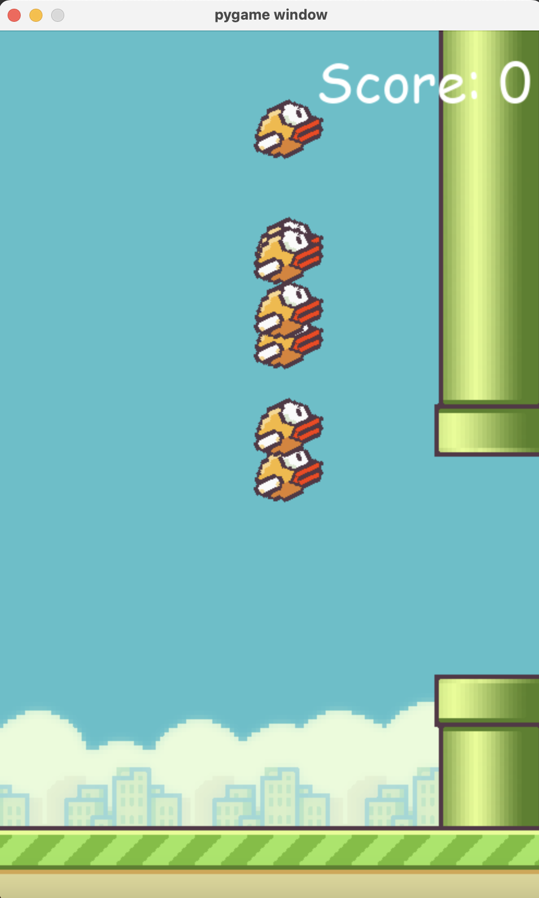

# AI Flappy Bird

In this project I took the flappy bird game which I built with python and pygame with an AI that learns to play the game using NeuroEvolution of Augmenting Topologies (NEAT).

## Description

The AI starts with no knowledge of the game and evolves over generations. It uses a neural network to decide when to jump based on its distance from the pipes and its current height. The fitness of each bird is determined by how long it survives and how many pipes it successfully passes.

## Screenshot

